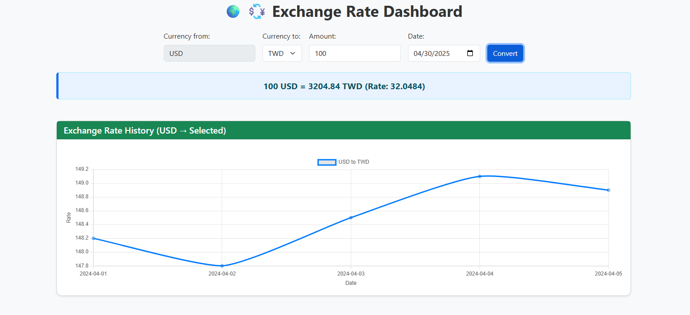
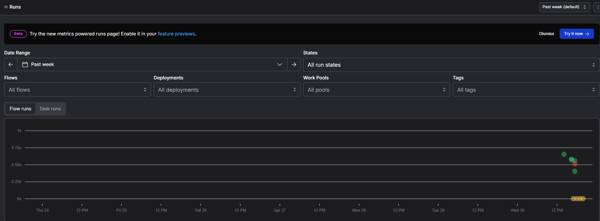
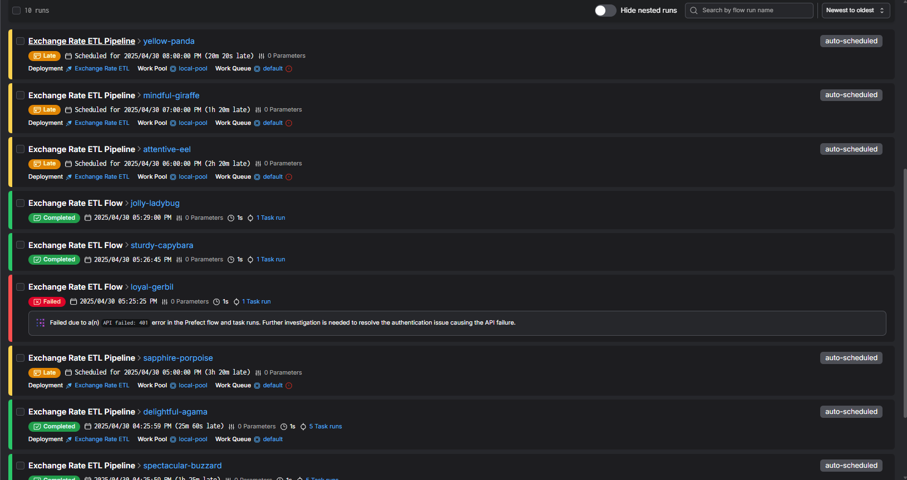

---
format:
  html:
    embed-resources: true
    toc: true
title: 'Exchange Rate ETL Pipeline'
---

## Abstract

This project presents an automated ETL (Extract, Transform, Load) pipeline for foreign exchange rate data, developed using Python and orchestrated with Prefect. The goal is to automate the retrieval, validation, transformation, and storage of real-time currency data in a scalable and maintainable way. The pipeline begins by fetching exchange rates from the exchangerate. host API, followed by schema validation using Pydantic to ensure data integrity and consistency. Validated data is then transformed through precision rounding and timestamp conversion, before being stored in both CSV and SQLite formats for flexibility in access and analysis.

To provide user interaction and visualization, a web dashboard was created to support real-time currency conversion and dynamically display current rates. In addition, the entire workflow is orchestrated and monitored through Prefect Cloud, enabling hourly execution and offering a clear audit trail of task outcomes. The prefect’s UI also provides insight into flow performance and failure diagnostics.

This project demonstrates how modern Python tooling, including data validation frameworks and workflow orchestration libraries, can be effectively combined to build robust, automated data systems. It highlights the practical challenges and solutions involved in designing pipelines that are both reproducible and production-ready.


---

## 1. Introduction

Exchange rates significantly impact international finances, business transactions, and international investments. For business and personal use, careful planning in relation to finance, business analytics, or cross-border transactions necessitates precise and timely records of rates. However, for high-frequency updates, large-scale data, or other bulk processes, maintaining up-to-date data is difficult and error-prone.

Some common challenges can range from the great need for undocumented APIs to inconsistent forms that require data retrieval, validation, and storage at regular intervals. Furthermore, services that lack adequate validation procedures may introduce significant quality risks, resulting in erroneous analyses or incorrect conversions.

To solve these challenges, our project incorporates an automatic ETL (extract, transform, load) pipeline that collects foreign exchange rate data from the exchange rate. The host transforms it according to business requirements, stores the output in CSV and SQLite formats, and validates the structure using Pydantic. The use of Prefect allows for scheduled execution, while the development of the web interface allows for better data visualization, which improves user experience. This system illustrates the effectiveness and universal accessibility of modern Python tools in creating reliable workflows.

---

## 2. ETL Pipeline Design

The ETL pipeline developed in this project follows a modular and reusable architecture composed of five main stages: **Extract**, **Validate**, **Transform**, **Load**, and **Orchestrate**. Each component is implemented as a standalone Python module and integrated using Prefect, enabling clear task separation and robust workflow orchestration.

### Tools and Libraries

The following tools and libraries are used throughout the pipeline:

- **`requests`** – for fetching exchange rate data from the exchangerate.host API
- **`pandas`** – for data manipulation and structuring
- **`pydantic`** – for schema validation and enforcing data integrity
- **`sqlite3`** – for lightweight database storage
- **`Prefect`** – for orchestration, scheduling, and monitoring of the entire pipeline

### ETL Workflow Overview

The pipeline operates as follows:

1. **Extract**  
   Exchange rate data is retrieved via a GET request to the exchangerate.host API. The request includes a base currency (e.g., USD) and one or more target currencies. The response is parsed and loaded into a `pandas` DataFrame.

2. **Validate**  
   Each record is validated against a predefined schema using `pydantic`. This ensures that all entries include valid base/target currency codes, a positive numerical rate, and a properly formatted timestamp. Invalid records are skipped and logged.

3. **Transform**  
   The validated data is then cleaned and formatted. This includes rounding the exchange rate values to four decimal places and converting UNIX timestamps to human-readable dates.

4. **Load**  
   The cleaned dataset is written to two output formats:
   - A `.csv` file for flat file access and quick inspection

5. **Orchestrate**  
   All tasks are orchestrated using a Prefect flow. The flow is configured for hourly execution using a cron-based schedule and is deployed to Prefect Cloud, enabling remote monitoring and execution tracking.

This modular design allows each part of the pipeline to be tested, reused, and extended independently while ensuring the overall workflow remains manageable and observable through Prefect's interface.

---
  
## 3. Implementation Details

### 3.1 Extract

The `extract.py` script handles data retrieval from the [exchangerate.host](https://exchangerate.host) API. A `GET` request is sent with a specified base currency and a list of target currencies. The response is parsed into a structured `pandas` DataFrame.

Example function:

```{python}
#| eval: false
#| code-fold: true
#| code-summary: "Show fetch_exchange_rates() example"

def fetch_exchange_rates(base_currency: str, target_currencies: list) -> pd.DataFrame:
    url = f"https://api.exchangerate.host/latest?base={base_currency}&symbols={','.join(target_currencies)}"
    response = requests.get(url)
    data = response.json()
    rates = data["rates"]
    df = pd.DataFrame([
        {"base": base_currency, "target": tgt, "rate": rate, "timestamp": data["timestamp"]}
        for tgt, rate in rates.items()
    ])
    return df
```


### 3.2 Validate

To ensure data integrity, each exchange rate record is validated against a predefined schema using **Pydantic**. The validation checks that:
- `base` and `target` are valid strings
- `rate` is a positive float
- `timestamp` is a valid integer

Any record that fails the schema validation is skipped and logged.

```{python}
#| eval: false
#| code-fold: true
#| code-summary: "Pydantic schema for validation"

class ExchangeRateRecord(BaseModel):
    base: str
    target: str
    rate: float = Field(..., gt=0)
    timestamp: int
```

The validated records are converted to dictionaries and passed to the transformation stage.

### 3.3 Transform

In this step, the validated dataset is formatted for usability. The exchange rate values are rounded to 4 decimal places to ensure consistent precision. Additionally, UNIX timestamps are converted to human-readable date strings (`YYYY-MM-DD`) to simplify analysis and visualization.

```{python}
#| eval: false
#| code-fold: true
#| code-summary: "Transformation function"

def transform_data(df):
    df["rate"] = df["rate"].round(4)
    df["date"] = pd.to_datetime(df["timestamp"], unit="s").dt.date
    return df
```

### 3.4 Load

After transformation, the data is stored in two formats:

- A `.csv` file, allowing for easy inspection and export
- A `SQLite` database table for structured queries and downstream integration

```{python}
#| eval: false
#| code-fold: true
#| code-summary: "CSV and SQLite save functions"

def save_to_csv(df, filename="exchange_rates.csv"):
    df.to_csv(filename, index=False)

def save_to_sqlite(df, db_path="exchange_rates.db"):
    conn = sqlite3.connect(db_path)
    df.to_sql("exchange_rates", conn, if_exists="replace", index=False)
    conn.close()
```

These outputs enable both lightweight reporting and deeper historical analysis.

### 3.5 Orchestration

The full ETL workflow is orchestrated using **Prefect**. Each stage—extract, validate, transform, and load—is defined as a Prefect task and composed into a flow. The flow is then deployed with a cron schedule to Prefect Cloud for remote execution and monitoring.

```{python}
#| eval: false
#| code-fold: true
#| code-summary: "Prefect flow definition"

@flow(name="Exchange Rate ETL Pipeline")
def etl_pipeline():
    df = fetch_exchange_rates("USD", ["EUR", "JPY", "TWD"])
    df = validate_data(df)
    df = transform_data(df)
    save_to_csv(df)
    save_to_sqlite(df)
```

The pipeline is deployed using the following command:

```{bash}
prefect deploy pipeline.py:etl_pipeline --name "Exchange Rate ETL" --cron "0 * * * *"
```


This orchestration ensures consistent execution and provides visibility into flow status, logs, and potential failures through Prefect's dashboard.

---

## 4. Results & Artifacts

This section presents the tangible outputs generated by the ETL pipeline, as well as screenshots from the Prefect orchestration interface and the frontend dashboard.

---

### 4.1 Sample Output

After validation and transformation, the processed exchange rate data is saved to CSV formats:

- **CSV file**: `open_exchange_rates.csv`

A sample of the cleaned data looks like:

```{text}
base,target,rate,timestamp
USD,AED,3.67296,1746046807
USD,AFN,71.071358,1746046807
USD,ALL,86.95,1746046807
```

This confirms that the data is well-structured, rounded to 4 decimal places, and includes a clean date column.

---

### 4.2 Dashboard Preview

A simple web interface was developed to support real-time currency conversion and explore current exchange rates. Users can select source and target currencies, input amounts, and view conversion results along with a live exchange rate chart.



---

### 4.3 Prefect Flow Monitoring

The pipeline is scheduled to run every hour using a cron job and is deployed to **Prefect Cloud**. The Prefect dashboard provides visibility into:

- Successful flow runs and logs
- Task duration and failures
- Deployment schedules





These tools enhance automation and observability, making the system production-ready and resilient to runtime errors.

## 5. Conclusion

This project offered an opportunity to build a fully computerized ETL pipeline focused on data extraction, validation, transformation, and storage with modern Python libraries and tools. I now understand better how to create modular data pipelines and orchestrate them with Prefect for scheduling and monitoring.  

The project can be partly credited to the Prefect's use for job monitoring and management. Adding Pydantic’s schema validation also aided in preserving data integrity past testing. The self-sufficient pipeline allows users to access derived outputs in both CSV and SQL formats, making it easy to scale and maintain.  

However, I will acknowledge that certain areas require additional work. The implemented solution focuses on processing real-time data; it does not capture historical data across execution cycles. Setting an archive flag allows the data to be longitudinally analysed over time. Additionally, adding a failover notification system via email or Slack would help notify users and improve overall system robustness.  

To summarize, this project showcased how effective modern Python tools are for automating data workflows while allowing room for adding features like historical data capture and dashboarding in the future.
---

## References

- [exchangerate.host API](https://exchangerate.host)
- [Pydantic Documentation](https://docs.pydantic.dev/)
- [Prefect Documentation](https://docs.prefect.io/)
